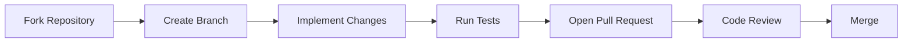

# 🤝 Contributing to the Platform

<div align="left">


</div>

Welcome! We're excited that you're interested in contributing.

Whether you're fixing bugs, improving documentation, optimizing performance, or building new features, this guide will help you contribute effectively.

> [!TIP]
> New contributors should start by reading **ARCHITECTURE.md** before making any code changes.

---

## ⚡ Quick Start

```bash
git checkout main
git pull origin main

git checkout -b feat/my-feature

npm install

npm run dev

```

---

## 🗺️ Contribution Journey



---

## 📚 Table of Contents

* [Repository Protection Rules](https://www.google.com/search?q=%23%25EF%25B8%258F-repository-protection-rules)
* [Project Architecture](https://www.google.com/search?q=%23-project-architecture)
* [Local Development Setup](https://www.google.com/search?q=%23%25EF%25B8%258F-local-development-setup)
* [Branch Naming Convention](https://www.google.com/search?q=%23-branch-naming-convention)
* [Commit Messages](https://www.google.com/search?q=%23-commit-messages)
* [Development & PR Workflow](https://www.google.com/search?q=%23-development--pr-workflow)
* [Pre-PR Checklist](https://www.google.com/search?q=%23-pre-pr-checklist)
* [Coding Standards](https://www.google.com/search?q=%23-coding-standards)
* [Testing Expectations](https://www.google.com/search?q=%23-testing-expectations)
* [Reporting Issues](https://www.google.com/search?q=%23-reporting-issues)
* [Security Policy](https://www.google.com/search?q=%23-security-policy)
* [Code Review Guidelines](https://www.google.com/search?q=%23-code-review-guidelines)

---

## 🛡️ Repository Protection Rules

> [!WARNING]
> **No Direct Pushes:** Direct pushes to `main` are disabled. All changes must go through a Pull Request.

> [!IMPORTANT]
> **Required Reviews:** Pull requests require approval and all conversation threads must be resolved before requesting a final review.

> [!TIP]
> **Linear History:** Rebase your branch before opening a PR to maintain a clean commit history. Avoid unnecessary merge commits.

```bash
git fetch origin
git rebase origin/main

```

---

## 🧠 Project Architecture

Our codebase is strictly modular to keep responsibilities clean.

### Frontend (Feature-Sliced Design)

Responsibilities must remain inside their respective features (e.g., Product logic inside the Product feature). Avoid putting business logic into shared utilities.

```text
client/
└── src/
    ├── app/
    ├── pages/
    ├── widgets/
    ├── features/
    ├── entities/
    └── shared/

```

### Backend (Modular Service-Oriented Architecture)

Each module encapsulates its own routes, controllers, services, validation, models, and business logic. Avoid cross-module coupling whenever possible.

```text
server/
└── src/
    └── modules/
        ├── auth/
        ├── seller/
        ├── product/
        └── order/

```

---

## 🛠️ Local Development Setup

### 1. Fork & Clone

```bash
git clone <your-fork-url>
cd repository-name

```

### 2. Environment Variables

Create environment files from the provided templates and configure all required values.

```bash
cp .env.example .env

```

### 3. Install Dependencies & Start Servers

Install dependencies for both client and server, then run them.

```bash
# Frontend
cd client
npm install
npm run dev

# Backend
cd server
npm install
npm run dev

```

---

## 🌿 Branch Naming Convention

Format: `<type>/<issue-number>-<short-description>`

| Type | Purpose | Example |
| --- | --- | --- |
| `feat` | New Feature | `feat/142-add-dashboard` |
| `fix` | Bug Fix | `fix/201-payment-error` |
| `docs` | Documentation | `docs/update-readme` |
| `refactor` | Code Cleanup | `refactor/auth-service` |
| `test` | Testing | `test/cart-service` |
| `chore` | Maintenance | `chore/update-eslint` |
| `style` | Formatting/Styling | `style/fix-button-padding` |

---

## 💬 Commit Messages

We strictly follow the **Conventional Commits** specification.

**Format:**

```text
<type>[optional scope]: <description>

[optional body]

[optional footer]

```

**Examples:**

```text
feat(auth): add refresh token rotation
fix(cart): resolve tax calculation issue
docs(api): update authentication guide
refactor(server): extract mongoose schema logic

```

---

## 🚀 Development & PR Workflow

Keep pull requests focused. A PR should ideally solve **one problem**. Avoid mixing new features, refactors, bug fixes, and documentation into a single PR.

### PR Description Requirements

* **Problem:** What issue exists?
* **Solution:** What was changed?
* **Impact:** What parts of the system are affected?
* **Visuals:** Include screenshots, screen recordings, or before/after comparisons for UI changes when applicable.

---

## ✅ Pre-PR Checklist

Before opening a pull request against `main`, ensure you have completed the following:

* [ ] Built successfully locally (`npm run build`)
* [ ] Linting passes (`npm run lint`)
* [ ] No TypeScript errors
* [ ] Unit and integration tests pass
* [ ] Documentation is updated (if applicable)
* [ ] Screenshots attached (for UI changes)
* [ ] Branch is successfully rebased on `main`

---

## 🎨 Coding Standards

### Frontend (React + TypeScript)

* **Components:** Use functional components and hooks. Prefer composition over prop drilling.
* **State Management:** Prioritize local state. Use **Zustand** for shared state.
* **Styling:** Use **Tailwind CSS**. For conditional classes, use the `cn(...)` utility.
* **Shared Components:** Place reusable UI components strictly in `src/shared/components/ui`.
* **Type Safety:** Avoid `any`. Prefer explicit types everywhere.

### Backend (Node.js + Express)

* **Controllers:** Should only receive requests and return responses. Nothing more.
* **Services:** Business logic belongs entirely in `.service.ts` files.
* **Validation:** Validate Body, Params, and Query using **Zod**.
* **Error Handling:** Use `AppError` and our centralized error handlers.

---

## 🐛 Reporting Issues

When creating an issue, please provide a clear explanation and include:

* **Description:** Summary of the problem.
* **Steps to Reproduce:** Numbered steps to trigger the bug.
* **Expected Behavior:** What you thought would happen.
* **Actual Behavior:** What actually happened.
* **Environment:** OS, Browser, and Node Version.

---

## 🔒 Security Policy

**Do not publicly disclose security vulnerabilities.**

Instead:

1. Contact maintainers privately.
2. Provide reproduction steps.
3. Allow time for remediation before disclosure.

---

## 👀 Code Review Guidelines

**When reviewing code:**

* Be respectful. Focus on the code, not the person.
* Explain suggestions clearly and provide alternatives when possible.

**When receiving reviews:**

* Assume positive intent.
* Ask clarifying questions if feedback is ambiguous.
* Address all comments professionally before re-requesting a review.

---

### ❤️ Thank You

Every contribution—whether it's code, documentation, testing, bug reports, or feedback—helps improve the platform. Thank you for taking the time to contribute and help make this project better for everyone! 🚀