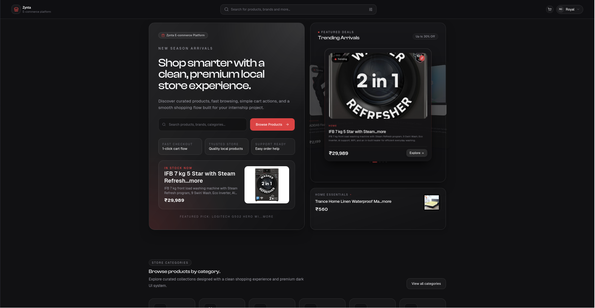
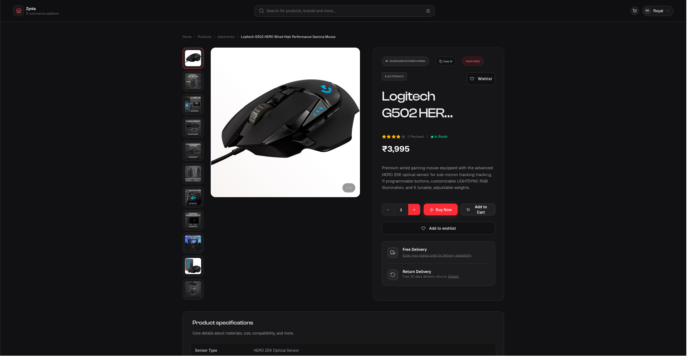
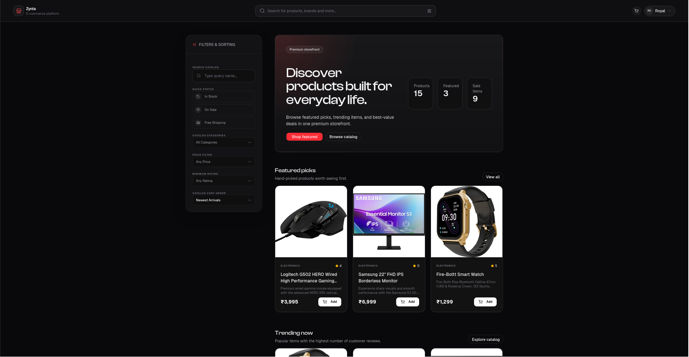
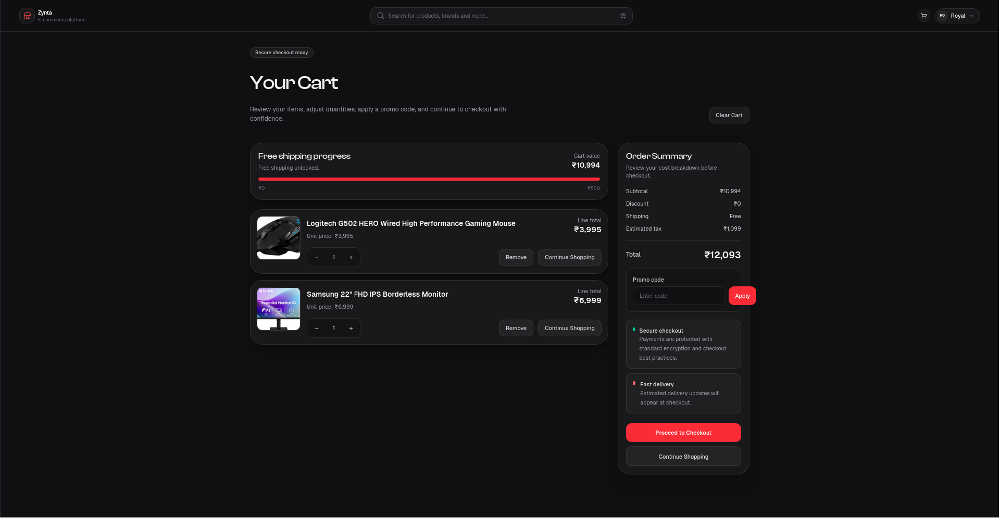
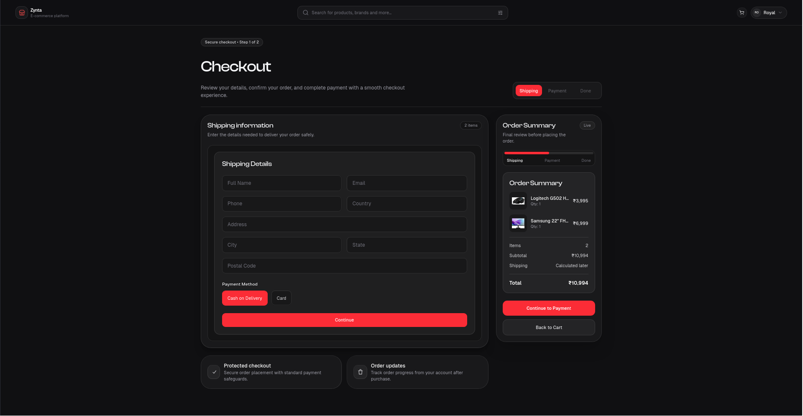

<div align="center">
  
  <br />
  <br />
  <h1>🛍️ Zyntra E-Commerce Platform</h1>
  <p><strong>A modern, production-ready full-stack Multi-Vendor marketplace ecosystem.</strong> Engineered with role-based access controls, robust architectural layers, and a feature-slice client strategy.</p>

  <p>
    <a href="https://zyntra-store.onrender.com"></a>
  </p>

  <p>
    <a href="https://react.dev/"></a>
    <a href="https://vitejs.dev/"></a>
    <a href="https://tailwindcss.com/"></a>
    <a href="https://nodejs.org/"></a>
    <a href="https://www.mongodb.com/"></a>
    <a href="https://typescriptlang.org/"></a>
  </p>
</div>

---

## 📱 Application Preview

### 🖥️ Interactive Demo Walkthrough
GitHub natively streams video files right inside the Markdown player. Look at the ecosystem overview and feature workflow timeline:

<video src="https://raw.githubusercontent.com/roydza27/PRODIGY_FS_03/main/assests/Zyntra.webm" width="100%" controls data-canonical-src="https://raw.githubusercontent.com/roydza27/PRODIGY_FS_03/main/assests/Zyntra.webm">
  Your browser does not support the video tag.
</video>

### 📸 Interface Galleries

<table width="100%">
  <tr>
    <td width="50%" align="center">
      <strong>🛒 Customer Storefront Portal</strong>
      <br />
      
    </td>
    <td width="50%" align="center">
      <strong>📦 Detailed Product Insight</strong>
      <br />
      
    </td>
  </tr>
  <tr>
    <td width="50%" align="center">
      <strong>🔍 Unified Catalog Exploration</strong>
      <br />
      
    </td>
    <td width="50%" align="center">
      <strong>🛍️ Active Shopping Basket</strong>
      <br />
      
    </td>
  </tr>
  <tr>
    <td colspan="2" align="center">
      <strong>💳 Secure Order Checkout Gateway</strong>
      <br />
      
    </td>
  </tr>
</table>

---

## 🔗 Live Deployment

* **⚡ Live Storefront Link:** [Live_Demo_Link](https://zyrastore-qijer8bgu-roydza062-gmailcoms-projects.vercel.app)

---

## ✨ Overview

This project is a production-ready, full-stack multi-vendor e-commerce platform. Designed with performance, scalability, and developer experience in mind, it utilizes a modular, feature-based architecture on the client and a clean, service-oriented architecture on the backend.

### 🎭 Role-Based Experiences
- **End-Users:** Browse products, manage carts, checkout securely, track orders, and manage wishlists/reviews.
- **Sellers:** Apply for a seller account, manage inventory, process orders, track earnings, and analyze sales metrics via a dedicated Seller Dashboard.
- **Administrators:** Comprehensive control over platform operations. Manage users, review and approve seller applications, moderate products, and view platform-wide analytics.

---

## 🚀 Features

- **Robust Authentication:** Email/Password and Google OAuth integration using JWT, with comprehensive session management via Zustand.
- **Multi-Vendor System:** Sellers have their own stores, isolated inventory, and order fulfillment flows. Admin approval flow for new seller applications.
- **Modern Frontend Architecture:** Built on React 19 and React Router v7. Code is organized by "features" to keep domain logic coupled and maintainable.
- **Type-Safe Backend:** Express + TypeScript API utilizing Zod for rigorous runtime request validation.
- **Beautiful UI:** Powered by Tailwind CSS v4, Framer Motion, and shadcn/ui. Highly accessible with Radix UI primitives.
- **Advanced State Management:** Zustand for global client state (Auth, Cart), minimizing boilerplate.

---

## 🛠️ Tech Stack

### Client-side
- **Framework:** React 19, Vite
- **Routing:** React Router v7
- **State Management:** Zustand
- **Styling:** Tailwind CSS v4, clsx, tailwind-merge
- **UI Components:** shadcn/ui, Radix UI, Lucide React, Tabler Icons
- **Forms & Validation:** React Hook Form, Zod
- **Animations:** Framer Motion, @dnd-kit (for drag and drop interfaces)

### Server-side
- **Runtime:** Node.js, Express v5
- **Language:** TypeScript
- **Database:** MongoDB with Mongoose ODM
- **Validation:** Zod
- **Authentication:** JSON Web Tokens (JWT), bcryptjs
- **Mailing:** Nodemailer

---

## 📂 Project Structure

A high-level overview of our feature-sliced workspace.

```text
.
├── client/
│   ├── src/
│   │   ├── app/            # Global setup (router, global stores, providers)
│   │   ├── features/       # Domain-specific modules (auth, admin, seller, products)
│   │   ├── hooks/          # Global reusable hooks
│   │   ├── lib/            # Utility libraries (e.g., shadcn utils)
│   │   ├── services/       # Global API configurations (Axios instances)
│   │   └── shared/         # Shared UI components, layouts, types, constants
│   └── vite.config.ts
│
└── server/
    ├── src/
    │   ├── config/         # Database and environment configurations
    │   ├── middlewares/    # Global Express middlewares (auth, error handling)
    │   ├── modules/        # Domain modules (auth, product, cart, orders, etc.)
    │   │   └── [module]/   # Contains controller, service, routes, model, validation
    │   ├── utils/          # Helper classes (AppError)
    │   ├── app.ts          # Express App setup & Route registration
    │   └── server.ts       # Server entry point
    └── package.json
```

---

## 🚦 Getting Started

### Prerequisites
- [Node.js](https://nodejs.org/) (v20+ recommended)
- [MongoDB](https://www.mongodb.com/try/download/community) (Local instance or MongoDB Atlas URI)
- npm or pnpm

### 1. Clone the repository
```bash
git clone https://github.com/roydza27/PRODIGY_FS_03.git
mv PRODIGY_FS_03 Zyntra
cd Zyntra
```

### 2. Environment Setup

**Server (`server/.env`)**
Create a `.env` file in the `server` directory:
```env
PORT=5000
MONGO_URI=mongodb://127.0.0.1:27017/ecommerce-db
JWT_SECRET=your_super_secret_jwt_key
JWT_EXPIRES_IN=7d
CLIENT_URL=http://localhost:5173
```

**Client (`client/.env`)**
Create a `.env` file in the `client` directory (if required for Vite, prefix with `VITE_`):
```env
VITE_API_BASE_URL=http://localhost:5000/api
```

### 3. Installation & Running Locally

You can run both client and server concurrently using separate terminals.

**Terminal 1: Start the Backend**
```bash
cd server
npm install
npm run dev
```
*The server will start on `http://localhost:5000`*

**Terminal 2: Start the Frontend**
```bash
cd client
npm install
npm run dev
```
*The client will start on `http://localhost:5173`*

---

## 🤝 Contributing

We love our contributors! For details on how to set up your environment, the branch naming conventions, and the pull request process, please read the [CONTRIBUTING.md](./CONTRIBUTING.md) file.

For architectural decisions and deep dives into the codebase, refer to the [ARCHITECTURE.md](./ARCHITECTURE.md) and [DEPLOYMENT.md](./DEPLOYMENT.md).

---

## 📄 License

This project is licensed under the [MIT License](./LICENSE) - see the LICENSE file for details.
